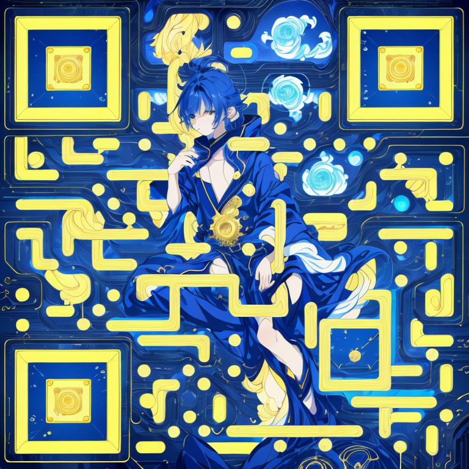

  <h1 style="font-family: 'Poppins', sans-serif; font-size: 2.8em; color: #00eaff; text-shadow: 0 0 15px rgba(0, 234, 255, 0.6); margin: 0;">
    🌌 <b>Phakaphol "PK" Dherachaisuphakij</b> 🌌
  </h1>
  <h3 style="font-family: 'Poppins', sans-serif; font-size: 1.5em; color: #b0b8d6; margin: 10px 0; letter-spacing: 1px;">
    Frontend Developer | Animation Specialist | UI/UX Designer
  </h3>
  

    Delivering Innovative Digital Solutions with Precision and Creativity
  

  
  
  

    <i>Dedicated to Excellence | Available for Projects: 14:00 - 23:30 ICT</i>
  

---

## 🌟 <b>About Me</b>

  

    I’m <b>Phakaphol "PK" Dherachaisuphakij</b>, a skilled <b>Frontend Developer</b> with a passion for creating seamless, visually stunning, and user-focused web experiences. With extensive expertise in <b>React</b>, <b>animation frameworks</b>, and <b>modern UI/UX design</b>, I specialize in transforming complex ideas into polished, high-performance digital solutions.
  

  

    My work emphasizes clean code, innovative design techniques—like <b>parallax effects</b> and <b>glassmorphism</b>—and a commitment to delivering projects that exceed expectations. Currently advancing toward <b>Full-Stack proficiency</b>, I’m eager to collaborate on impactful projects that demand creativity and technical precision. Let’s build something exceptional together!
  

---

## ⚙️ <b>Core Competencies</b>

  <ul style="list-style-type: none; padding: 0; font-family: 'Poppins', sans-serif; font-size: 1.2em; color: #2d3748; line-height: 2;">
    <li>🌐 <b>Frontend Excellence</b>: React, Next.js, Tailwind CSS—crafting responsive, high-quality interfaces</li>
    <li>🎨 <b>Animation Mastery</b>: Framer Motion, GSAP, Three.js—bringing designs to life with fluid motion</li>
    <li>🖌️ <b>UI/UX Expertise</b>: Modern design trends (Glassmorphism, Parallax)—balancing aesthetics and usability</li>
    <li>💡 <b>Problem-Solving</b>: Efficiently tackling challenges with elegant, scalable solutions</li>
  </ul>

---

## ⏱️ <b>Development Activity</b>

  
  

    <i>Consistently delivering results through disciplined coding practices</i>
  

---

## 🏅 <b>Portfolio Highlights</b>
### <b>Discover My Work</b>

  
  

    <i>Showcasing technical expertise and creative design in every project</i>
  

---

## 📽️ <b>Video Demonstrations</b>

  
  
  

---

## 🤝 <b>Let’s Collaborate</b>

  

    Looking for a dedicated developer to bring your next web application, animation, or UI/UX vision to life? I’m available to collaborate on projects that demand innovation, quality, and timely delivery. Reach out to discuss how I can contribute to your success—let’s create something remarkable!
  

  

    #FrontendExpertise #CreativeSolutions #HireMe
  

